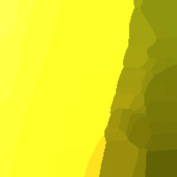
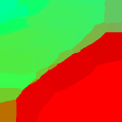
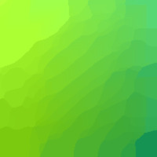
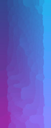
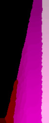
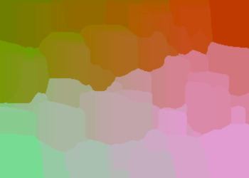
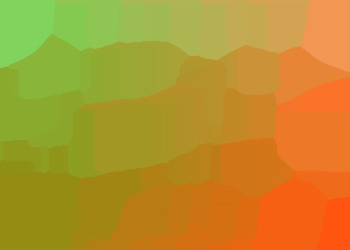
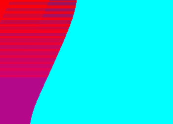

# abstract-background-image-generator
Generates abstract images of user-defined dimensions. Installation instructions and example images shown.

This is a shell script that works on Linux systems.

Still working on the README, to be updated soon.

## Installation
This shell script uses the fish shell v 3.0.2. The script will not work with bash or any other shell, or with previous versions of fish (the latter is due to the usage of the 'random' function). The fish shell is easy to install and works out of the box. 
- For Debian-based Linux systems such as Ubuntu, you can install fish via the synaptic package manager. 
- For other distros, see [fish shell](https://fishshell.com/) for installation; fish is available for virtually all distros.

This script also uses the imagemagick package, which by default is already installed on most mainstream Linux distros. If you have the convert command (try man convert) then you have imagemagick. If you don't have imagemagick, then you will need to install it; for Debian-based systems it's available via the synaptic package manager. The version of imagemagick I used is v6.9, but older versions are also likely to be compatible.

## Usage
After you have the fish shell installed as described above, download the shell script in this repo. Navigate to the directory where the shell script is located, and open a command-line terminal.
At the prompt, type `fish`
Now you are in the fish shell. If the downloaded shell script is not already executable, make it so `chmod u+x createimages.fish`
Execute the downloaded script ` ./createimages.fish `

You will be prompted for the number of images desired, their x dimensions, y dimensions, and a base filename. The images will then be created as JPEGs.

## Examples
These are a few examples of the images generated; 3 squares, 3 tall rectangles and 3 horizontal rectangles are shown.

  

  

  

